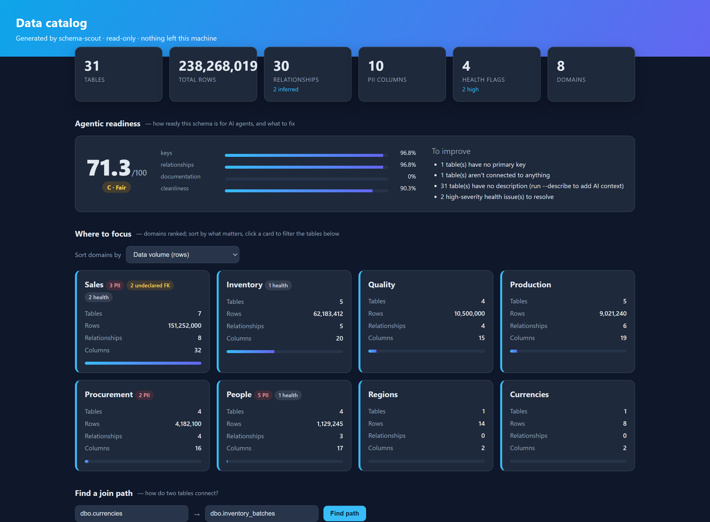
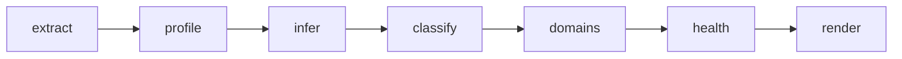

# schema-scout


Point it at a SQL Server database with 150+ tables and get back a data
catalog you can actually read: every table classified, the relationships
mapped (including the ones nobody bothered to declare as foreign keys), PII
flagged, a health report, an ER diagram, and an interactive offline dashboard
to explore it all. Optionally, plain-English descriptions written by a local
LLM so nothing about your schema leaves the machine.

It exists because you cannot understand a few thousand columns by scrolling
through SSMS, and because the first thing a natural-language-to-SQL tool needs
is a map of what's in the database. This builds that map.



*The offline dashboard: domains ranked by where to focus, a join-path finder, health flags, PII, and every table searchable. Synthetic demo data — generate it yourself with `python -m schema_scout.cli demo --large`.*

## What you get

- A relationship map, including the **undeclared foreign keys** legacy schemas leave out
- Tables classified (fact / dimension / bridge / reference) and grouped into **subject areas**
- **PII flagged** by column name and sample values
- A **health report**: no primary key, orphan tables, all-null / constant / mostly-null columns
- A **join-path finder** between any two tables
- Sampled or exact **column profiling** (null %, cardinality, ranges, examples)
- An offline **dashboard**, plus JSON, Markdown, a Mermaid ER diagram, an FK-constraint SQL script, and dbt relationship tests
- Optional **plain-English descriptions** from a local LLM, on-prem

## What it does

The work is split into stages so each one scales on its own:

| Stage | What happens | Cost on a big DB |
|---|---|---|
| **extract** | Reads structure from `sys.*` — tables, columns, PKs, FKs, row counts | A handful of queries, no table scans |
| **profile** | Samples the top tables and computes null %, cardinality, ranges, top values | One query per table, opt-in |
| **infer** | Finds undeclared foreign keys by name/type, optionally confirms by value inclusion | Cheap; inclusion check is opt-in |
| **classify** | Tags each table fact / dimension / bridge / reference, flags PII columns | Pure, in-memory |
| **health** | Flags no-PK, orphan, all-null, constant and mostly-null columns | Pure, in-memory |
| **usage** | Ranks tables by real query activity (Query Store / DMVs) | One query, opt-in |
| **render** | Writes the dashboard, JSON, Markdown, Mermaid ER diagram, plus FK-constraint SQL and dbt tests | Pure, in-memory |

Row counts come from partition statistics, not `COUNT(*)`, so the structure
pass is instant no matter how big the tables are. Profiling is the only stage
that reads data, it's sample-based by default, and it only touches the ~25
highest-value tables (most rows, most referenced) instead of all 150. When you
need certainty rather than an estimate — for example to confirm a column is
actually unique before trusting it as a key — `--exact-keys` runs full-table
aggregates instead of sampling.



## Why the inference matters

Old and ERP-style schemas usually have very few declared foreign keys, so the
relationship map is invisible to the catalog. schema-scout guesses the missing
edges: a column like `customer_id` that isn't its own table's key, pointing at
a `customers` table with a single-column primary key, is almost certainly a
relationship. Type agreement raises the confidence. If you pass `--validate`
it checks the actual values — "do 99% of `orders.customer_id` exist in
`customers.id`?" — and promotes a guess to near-certainty. Every inferred edge
is labelled with its confidence and reasoning so a human can accept or reject
it. It suggests; it doesn't decide.

## Install

```bash
pip install -r requirements.txt        # pyodbc + pandas (+ requests for AI, pytest for dev)
```

You also need a SQL Server ODBC driver. On Windows the easiest is Microsoft's
**ODBC Driver 18 for SQL Server**. schema-scout picks whichever driver is
installed automatically.

## Use it

See the whole thing run on a synthetic schema, no database required:

```bash
python -m schema_scout.cli demo
```

Against your database (Windows auth):

```bash
python -m schema_scout.cli run --server localhost --database FactoryDB
```

With profiling and on-prem AI descriptions:

```bash
python -m schema_scout.cli run --server localhost --database FactoryDB \
    --profile --validate --describe --model qwen3:14b
```

Or give it a full connection string instead of host/database:

```bash
set SCHEMA_SCOUT_CONN=DRIVER={ODBC Driver 18 for SQL Server};SERVER=...;DATABASE=...;Trusted_Connection=yes;TrustServerCertificate=yes
python -m schema_scout.cli run
```

Output lands in `out/`:

- `catalog.html` — a self-contained dashboard (see below); double-click to open
- `catalog.json` — the machine-readable catalog
- `catalog.md` — the human catalog (subject areas, tables by size, PII list, health, per-table detail)
- `erd.mmd` — a Mermaid ER diagram (scoped to the biggest tables so it stays readable; raise `--erd-tables` or scope it yourself)
- `relationships.sql` — a reviewable `ALTER TABLE … WITH NOCHECK ADD CONSTRAINT` script for the inferred (and declared) foreign keys, for a DBA to apply
- `dbt_relationships.yml` — a dbt sources schema carrying `relationships` tests for every foreign key

## The dashboard

`catalog.html` is a single file with the data embedded and no external
resources — no server, no CDN, no network — so you can hand it to someone and
they just open it. It's built for deciding **where to focus**: it groups the
tables into subject areas (domains) and lets you rank those domains by data
volume, PII exposure, number of tables, modelling debt (undeclared foreign
keys), or query usage. Click a domain to filter; search and drill into any
table to see its columns, profile stats and relationships.

It also carries the analysis, so you don't need the raw files to use it:

- **Find a join path** — pick any two tables and it traces how they connect
  (the shortest chain of joins), which is how you make sense of a 147-table
  schema that will never fit on one ER diagram.
- **Health** — a collapsible list of the structural / data-quality issues
  (no primary key, orphan tables, all-null / constant / mostly-null columns),
  rolled up per domain so risk is visible where it lives.
- **PII and usage** badges on every domain card.

Domains are detected automatically: by table-name prefix when the schema uses
module prefixes (`SalesOrder`, `SalesOrderLine`, …), or by foreign-key
connectivity otherwise. Force one with `--domains prefix|components`. Like the
classification, it's a heuristic starting point — rename or merge as needed.

### Useful flags

- `--profile` / `--profile-limit N` / `--sample-size N` — sampled profiling of the top N tables
- `--exact-keys` — exact (full-table) profile of key-like columns to confirm primary keys; sampled distinct counts are estimates, this isn't
- `--exact` — exact profile of every aggregatable column (heavier; use on a single table or a small `--profile-limit`)
- `--validate` — confirm inferred FKs against real values
- `--no-infer` — structure only, no relationship guessing
- `--min-confidence X` — drop inferred FKs below this confidence
- `--usage` — rank tables/domains by query activity (needs Query Store enabled or `VIEW SERVER STATE`)
- `--path FROM,TO` — print the join path between two tables, e.g. `--path dbo.orders,dbo.customers`
- `--describe` / `--model` / `--ollama-host` — local-LLM descriptions via Ollama
- `--erd-tables N` — how many tables to draw in the diagram
- `--domains auto|prefix|components` — how to group tables into subject areas

## Read-only, on purpose

Every query is a SELECT, the connection is opened read-only, and the AI step
runs against a **local** Ollama, so neither your data nor your schema is sent
anywhere. That's the whole point for a regulated or privacy-sensitive
database.

## Tests

```bash
python -m pytest
```

The inference, classification, PII detection, health checks, join-path search,
usage scoring, FK export, and rendering logic are all pure functions tested
without a database. The demo schema includes a deliberately undeclared foreign
key so the inference and join-path paths are exercised end to end.

## Roadmap & future scope

schema-scout is early and SQL Server only today. The headline next step is
**support for more databases** (PostgreSQL and MySQL, then Snowflake/BigQuery)
behind a small dialect layer, the change that opens it up to most teams. After
that: publishing to PyPI, schema-change history (diff two runs over time),
column-level lineage, a printable data dictionary, and more LLM providers for
the descriptions step. The full plan is in [ROADMAP.md](ROADMAP.md).

Contributions are welcome — see [CONTRIBUTING.md](CONTRIBUTING.md).

## License

MIT.
